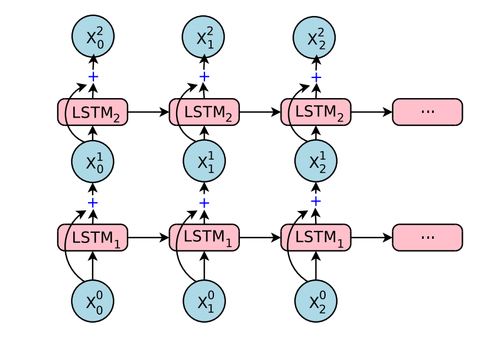
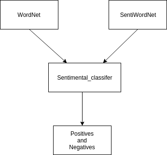
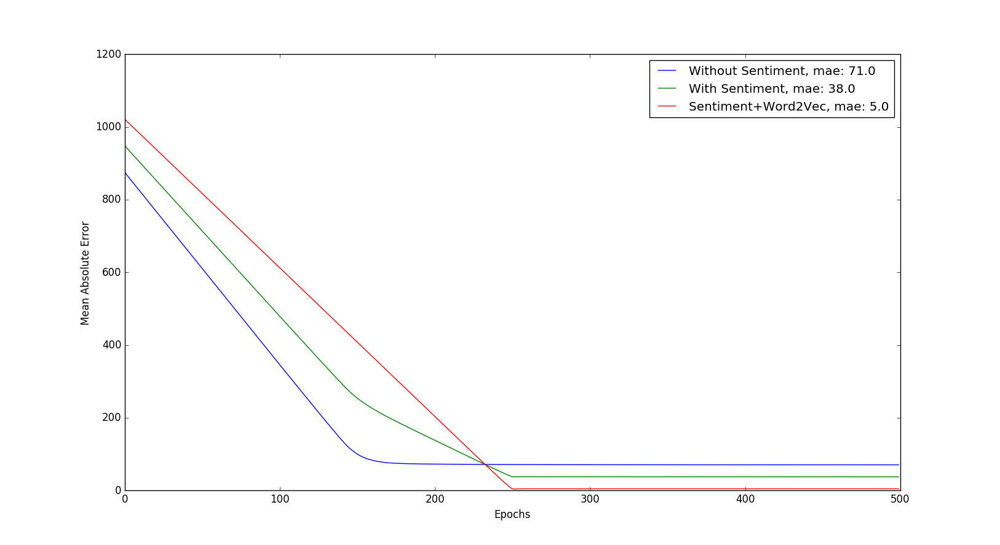

# Stock price prediction using sentiment analysis

This comparative study aims to find the relation between the social popularity of a company and its stock price value

## Index
[Interpretation of Problem Statement](#interpretation-of-problem-statement)  
[Why build this?](#why-build-this?)  
[Business use cases](#business-use-cases)  
[Assumptions](#assumptions)  
[The Dataset](#the-dataset)  
[Baseline Model](#baseline-model)  
[Features For Without Sentiment](#features-for-without-sentiment)  
[Features For With Sentiment](#features-for-with-sentiment)  
[Features For With Sentiment And The Tweet Encoded](#features-for-with-sentiment-and-the-tweet-encoded)  
[Effects of tweets on stock price prediction](#effects-of-tweets-on-stock-price-prediction)  
[Comparision](#comparision)
[Conclusion](#conclusion)  
[Future scope](#future-scope)

## Interpretation of Problem Statement
Finding statistical correlation between social media sentiment and stock prices of companies.
First what we tried to do is take six features excluding social media sentiment and predict the stock prices and then
use the social media sentiment as an additional feature and predict the same.
The difference in accuracy in both the models proved the postive correlation between them.

## Why build this?
Social media plays very important role in changing a company's perception towards customers.
Every company is trying to create a positive image through social media,
Companies have even started customer care services using their twitter handles.
Even our government uses twitter for solving common man problems.A very recent example is our Honorable Railway Minister
Piyush Goyal answering [Does India actually need bullet train](https://www.quora.com/Does-India-actually-need-a-bullet-train).

## Business use cases
This can benifit companies in this manner  
* This model can be used to test whether a particular post will affect positively or negatively before posting it on social platforms  
* Also if positive social media presence is a factor for rising stock price of a company,every company will eventually try to build a good overall social media profile.  

## Assumptions
Given the limited time of the hackathon these were our constraints:
* One company's(Google) stock data was taken and evaluated  
* Tweets were taken into consideration as they were easily available through the twitter API  
* Tweets of the past day were taken into account.    

## The Dataset

* We have focused on only 1 company as the main aim is to find the relation between sentiment and the stock price
* We have used the stock prices of Google (GOOG) in the NASDAQ market
* The series that we monitored was 1 day long (9:30am-4pm EDT)
* The aim was to predict the stock price in the time interval of 2 mins
* The stock prices were scraped from yahoo finance
* For the sentiment analysis we took tweets related to google using the twitter's api.

## Baseline Model

The model that we used to predict the stock prices was stack many to one LSTM  

The model remained the same for the comparision purpose, only the input features were changed  

Loss : MSE  
Error: Mean Absolute Error  
Optimization: rmsprop  
Epochs: 500  
Activation: tanh

## Features For Without Sentiment

For the 1st task we used the following Features
* Open Stock price  
* Low price
* High price
* Volume
* Running Max price
* Running Min price

The variable that was to be predcited was the closing price within that time span

## Features For With Sentiment
Preprocessing  

Along with the previous features we added some features related to sentiment

The below image explains it all  

Then we took the average of the positiveness, and the negativeness across the different tweets in a given time span

So two new features  
* positiveness
* negativeness

Total features - 8  

## Features For With Sentiment And The Tweet Encoded

Along with the previous features, we encoded each tweet using a variation of the Word2Vec model(encoded in 50 dimension)

Again we took weighted averages of the tweets belonging to one time span

And now along with the previous 8 features we added these 50 features totalling upto 58 features

## Effects of tweets on stock price prediction

Let's see how does tweet affect the stock value of google.Our aim here is to see does taking tweet into consideration improves the accuracy.

**Tweet under test**  
Thanks to #Google for the extended warranty, but I have to say my #Pixel2XL is fantastic, no issues whatsoever. Best phone of 2017 IMHO.  
numerically:  
positiveness - 0.625,  negativeness - 0.375

This tweet is positive in sense since it praises google pixel.  

At first the price was predicted on the baseline model i.e without considering the tweet.We gave the features of the previous time step as the input so that the model could predict the stock value at the next time step

The actual stock value -  **1032 USD**  
The value predicted by the baseline model - **965 USD**

Now, we considered tweet as a input feature  
The value predicted by the updated model - **1030 USD**

Thus we could infer that considering the tweet sentiment does affect the stock price value positively

## Comparision

The Mae curve  
The below curve compares the error of various model trained for prdicting the stock price value

## Conclusion

So the conclusion that we deduced, was that there is some relation between the popularity on the social media and the companie's stock price (This relation can be evaluated statistically using the various correlation coefficient)

## Future scope
* Data can be taken from other social media platforms such as Facebook,LinkedIn and other news platforms  
* Data for a longer period and multiple companies can be used to improve accuracy  
